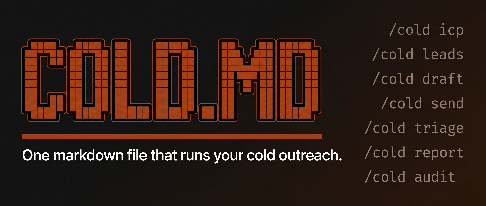

<!-- Updated: 2026-04-17 -->



# cold.md - The Claude Code plugin that runs your cold outreach

[](LICENSE)
[](https://creativecommons.org/licenses/by/4.0/)
[](https://claude.ai/claude-code)
[](https://cold.md)

Six skills, one `/cold` command. ICP builder, lead sourcing, drafter, sender, reply triage, reporter. Reads a portable `cold.md` spec from your repo. Backed by [FoxReach](https://foxreach.io) for sending.

**Not another cold-email skill.** The other Claude Code cold-email skills on the market draft messages. That's step 3 of a six-step loop. `cold.md` is the whole loop.

## Install in 30 seconds

```bash
curl -fsSL https://cold.md/install | bash
```

That installs the full `cold-md` plugin (all 6 skills, the `/cold` router) to `~/.claude/plugins/cold-md/`. Pass `--skills-only` to skip the plugin and get the open skills only. Pass `--scaffold` to also drop `cold.md` + `icp.md` templates in your current repo.

## The loop

```bash
/cold icp https://your-site.com       # Step 1: who - builds icp.md
/cold leads --count 100                 # Step 2: prospects - writes leads.csv (v0.2)
/cold draft Jane, CEO at Acme           # Step 3: draft from cold.md
/cold send ./leads.csv                  # Step 4: queue via FoxReach (v0.2)
/cold triage                            # Step 5: sort replies, draft responses (v0.2)
/cold report weekly                     # Step 6: digest on cron
```

## The six skills

| # | Skill | Purpose | v0 Status | Requires |
|---|---|---|---|---|
| 01 | [`cold-icp`](skills/cold-icp/) | Build `icp.md` from a URL or Q&A | **Live** | Nothing |
| 02 | [`cold-leads`](skills/cold-leads/) | Source leads matching `icp.md` into `leads.csv` | Stub (v0.2) | FoxReach API key |
| 03 | [`cold-draft`](skills/cold-draft/) | Draft openers, bumps, breakups from `cold.md` | **Live** | Nothing |
| 04 | [`cold-send`](skills/cold-send/) | Queue campaign via FoxReach with safety checks | Stub (v0.2) | FoxReach API key |
| 05 | [`cold-triage`](skills/cold-triage/) | Sort inbound replies, draft responses | Stub (v0.2) | FoxReach API key |
| 06 | [`cold-report`](skills/cold-report/) | Daily or weekly digest, cron-ready | **Live** | FoxReach API key |

Stubs are intentional. They define a stable contract so you can wire your own tooling today; the full implementation ships in v0.2.

## The two files

```
./cold.md   # voice, sequence, proof, banned - what the skills write
./icp.md    # audience, disqualifiers, qualification checklist - who they target
```

Both live at your repo root. Both are plain markdown. Both are portable across vendors.

### `cold.md` at a glance

```
# My Product - cold.md

## Identity    - who's sending
## Audience    - ICP + disqualifiers
## Value       - the offer, in one sentence
## Voice       - dos and don'ts, obeyed verbatim
## Proof       - facts the agent may cite
## Sequence    - opener, bump, breakup slots
## Objections  - preferred replies to pushbacks
## Banned      - phrases that never appear
```

Spec: [`spec/cold-md-v0.md`](spec/cold-md-v0.md). Also published at [cold.md](https://cold.md).

## Why a suite, not a skill

| Single cold-email skill | cold.md suite |
|---|---|
| Writes copy when asked | Owns every step: ICP → leads → draft → send → triage → report |
| No ICP, no sending, no triage | All six, each callable independently |
| Config lives in the prompt | Config lives in `cold.md` + `icp.md` in your repo |
| Every project restarts from scratch | Files travel with your team |
| Vendor-locked to whichever LLM | Vendor-neutral spec. Swap backends without rewriting. |

## Configure FoxReach

The skills that source leads, send, triage, or report need an API key:

```bash
export FOXREACH_API_KEY=fr_...
```

Free tier: https://foxreach.io/signup.

## Automated reporting

`cold-report` is designed to run unattended. Two recommended paths:

**(a) FoxReach dashboard** - schedule digest in Notifications. Posts to Slack/email. Zero local setup.

**(b) Claude Code `/schedule` skill** - for power users who keep Claude Code running:
```bash
/schedule "0 9 * * 1" "cold report weekly"
```

## Repository layout

```
spec/             The cold.md file spec. Versioned.
skills/           The six standalone skills (each installable solo).
plugin/cold-md/   The Claude Code plugin that bundles all six + the /cold router.
examples/         Sample cold.md files (minimal starter + the real FoxReach one).
site/             Next.js site at cold.md.
assets/           Cover image, brand.
memory/           Architecture, decisions, changelog.
```

## Contributing

The spec is the product. Every change to `spec/` is a commercial decision - open an issue first. New skills, examples, docs, and implementations: PRs welcome. Especially interested in other backend implementations (Smartlead plugin? Mailcoach plugin? PR it).

## License

- **Code** (skills, plugin, site): [MIT](LICENSE)
- **Spec** (`spec/*`): [CC-BY-4.0](https://creativecommons.org/licenses/by/4.0/)

## Star history

[](https://star-history.com/#concaption/cold-md&Date)

## Built by

The team at [FoxReach](https://foxreach.io). Cold email infrastructure that doesn't torch your domain.
